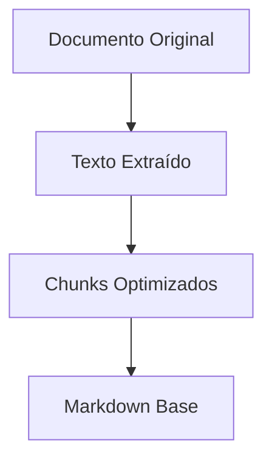
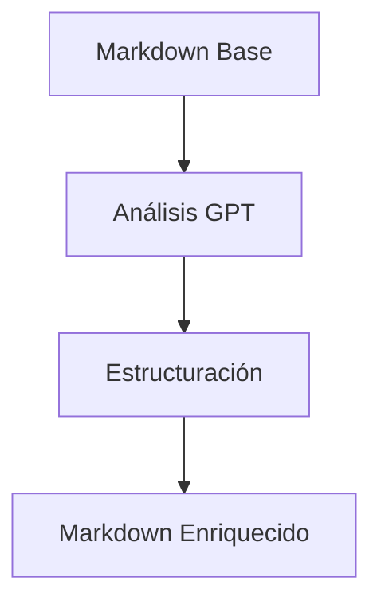
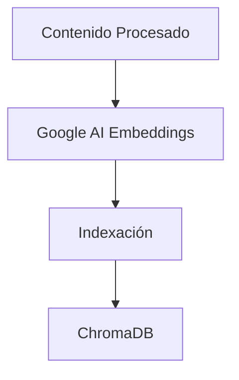
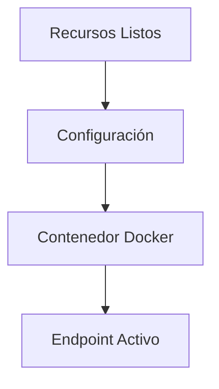

# 📋 Proyecto #1 - Academic Agents As A Service

Una aplicación web completa que permite a los profesores crear chatbots especializados para sus cursos la cual incluye autenticación y manejo de usuarios y carga de materiales procesados automáticamente a través de una interfaz intuitiva y moderna.

## 👥 Integrantes del Equipo

- Nicolas Rozo Fajardo - n.rozo@uniandes.edu.co
- Manuela Pachecho Malagón - m.pachechom2@uniandes.edu.co
- Juan Andrés Ariza Gacharná - ja.arizag@uniandes.edu.co
- Nathalia Quiroga Alfaro - n.quiroga@uniandes.edu.co

## 🎥 Demostración

El proyecto incluye una demostración en video que muestra todas las funcionalidades del mismo. Puede consultar el video en el siguiente enlace:

## ✨ Características Principales

- **🔐 Autenticación de usuarios** - Sistema completo de registro, login y gestión de usuarios.
- **🎓 Agentes Académicos Personalizados** - Crea chatbots especializados para cada curso.
- **📚 Procesamiento Inteligente de Documentos** - Soporte para PDF, PPT, DOCX con vectorización automática.
- **👨‍🏫 Panel de Control Docente** - Gestión completa de agentes y recursos educativos.
- **🧪 API Testing** - Colecciones completas de Postman incluidas.

## 🏗️ Arquitectura del Proyecto

La aplicación está compuesta por los siguientes servicios:

### 🎯 Servicios Core
1. **Frontend**

- React + Create React App
- Interfaces especializadas por rol
- Diseño responsive y moderno

2. **Backend**

- FastAPI para APIs REST
- Sistema de colas con RabbitMQ
- Autenticación JWT
- ChromaDB para almacenamiento vectorial

### 🔄 Pipelines de Procesamiento
- **Preprocesador:** Conversión de documentos a formato unificado.
- **Formateador:** Estructuración inteligente del contenido.
- **Vectorizador:** Generación de embeddings con Google AI.
- **Despliegue automático:** Gestión automatizada de contenedores Docker.

### 💾 Almacenamiento
- **PostgreSQL:** Datos transaccionales y gestión de usuarios.
- **ChromaDB:** Base de datos vectorial para búsqueda semántica.
- **RabbitMQ:** Cola de mensajes para procesamiento asíncrono.

### 🛠️ Herramientas de Desarrollo
- **Docker:** Contenedores para todos los servicios.
- **Git:** Control de versiones.
- **Postman:** Colecciones de APIs documentadas.

## 🔄 Flujo de Datos del Sistema

### 1. Carga de Materiales 📚

- El docente sube archivos en formato PDF, DOCX, PPT o TXT

### 2. Pipeline de Transformación 🔄

#### 2.1 Preprocesamiento 📋

#### 2.2 Formateo Inteligente 🎨

#### 2.3 Vectorización 🧮

#### 2.4 Despliegue del Agente 🚀

## 🚀 Inicio Rápido

### Prerrequisitos

Antes de ejecutar la aplicación, asegurese de contar con las siguientes dependencias en su dispositivo:

